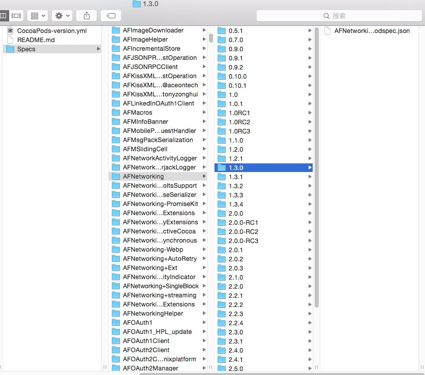
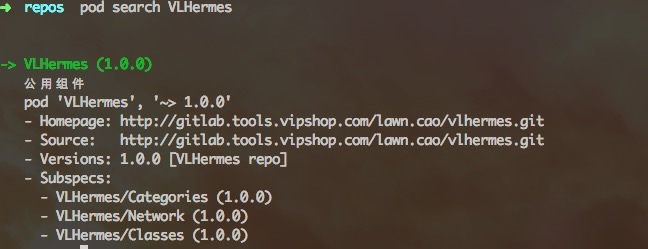

# Cocopods私有包的创建

使用cocopods可以将工程中的公用部分打成一个pod组件，方便其他工程引入，同时也比较方便用作版本管理。

## 安装Cocopods

安装比较简单，Mac下自带ruby，使用ruby的gem命令即可直接下载安装。

	sudo gem install cocoapods

	pod setup
	
如果gem太老，可以尝试下面的命令升级gem。

	sudo gem update --system
	

上面的`pod setup`命令执行之后，我们会发现 **~/.cocoapods/repos/master/Specs** 下有很多cocopods配置文件，大概有240M的内容，所以执行这个`pod setup`可能会有点慢。其实执行`pod search`命令就是从这里查找的。

## 分析Cocopods配置文件目录

Cocopods配置文件目录在 **~/.cocoapods/** ，在该目录下存放的就是Cocopods配置文件，执行 **pod setup** 实际上就是从git上下载配置文件【[git链接](https://github.com/CocoaPods/Specs.git)】，如果我们需要创建 **Private Pod** ，可以从这个目录着手。

以我们熟知的AFNetworking为例子，目录结构为 **AFNetworking &gt; 1.3.0 &gt; AFNetworking.podspec
**。

下面我们就要朝着这个方向来创建Private Pod。

## 创建私有的Pod

假设我们有这样一种场景，一个app是由多个团队共同开发的，每个团队负责自己的业务模块。我们希望每个团队的代码都是相对独立的，或者说分别在不同的git仓库中，这样就不太会因为某一个团队提交了无法编译的代码导致开发延时。

要处理这样的需求，其实很简单，我们可以借助私有Pod。

如果公司有gitlab，可以开一个仓库，存放Cocopods配置。

	mkdir VLHermes
	
	cd VLHermes
	
	mkdir 1.0.0
	
	pod spec create VLHermes
	
这4条命令执行完之后，我们就能看到这样的目录结构
	

我们可以看到VLHermes.podspec，这个就是Cocopods的配置文件，里面定义了Cocopods的名称、版权、描述、引用关系等等。文件的语法可以参照[官方文档](https://guides.cocoapods.org/syntax/podspec.html)。

	Pod::Spec.new do |ss|
	
	  # ――― 组件描述信息  ――――――――――――――――――――――――――――――――――――――――――――――――――――――――― #
	  ss.name = "VLHermes"
	  ss.version = "1.0.0"
	  ss.summary = "公用组件"
	  ss.description = "唯风尚公用组件，包括网络、视图等等."
	  ss.homepage = "https://www.gitbook.com/@lawn/dashboard"
	  ss.license  = "MIT"
	  ss.authors  = { 'Viplux' => 'lawn.cao@vipshop.com' }
	
	  # ――― 组件配置  ――――――――――――――――――――――――――――――――――――――――――――――――――――――――― #
	  ss.platform = :ios, "7.0"
	  ss.requires_arc  = true
	  ss.source = { :git => "{gitlab address}/lawn.cao/vlhermes.git", :tag => "#{ss.version}" }
	
	  ss.public_header_files = 'VLHermes/VLHermes.h'
	  ss.source_files = 'VLHermesKit/VLHermes.h'
	
	  ss.subspec "Categories" do |subS1|
	    subS1.source_files = 'VLHermesKit/Categories/*.{h,m}'
	    subS1.public_header_files = 'VLHermesKit/Categories/*.h'
	  end
	
	  ss.subspec "Network" do |subS2|
	    subS2.source_files = 'VLHermesKit/Network/*.{h,m}'
	    subS2.public_header_files = 'VLHermesKit/Network/*.h'
	    subS2.dependency 'VLHermes/Categories'
	    subS2.dependency 'AFNetworking', '~>2.5.0'
	    subS2.dependency 'SSKeychain', '~>1.2.3'
	  end
	
	  ss.subspec "Classes" do |subS3|
	    subS3.source_files = 'VLHermesKit/Classes/*.{h,m}'
	    subS3.public_header_files = 'VLHermesKit/Classes/*.h'
	  end
	
	end

具体涵义可以去看看官方文档，最重要的几项包括：

* name	Cocopods引用的唯一标识，可以通过`pod search` 搜索到的名字。

* version 版本号。

* source Cocopods对应的代码库，tag标识改代码库打的标签。

* public_header_files 通常是.h文件，作为一个pods库的主入口，被其他项目引用。
 
* source_files 哪些代码需要被打入到pods里面。
 
* dependency 依赖的其他pods库，如果在这里定义好，主工程里面的Podfile就不需要重复定义了。

* frameworks 工程依赖的哪些基础框架，如QuartzCore、CoreData等等。

验证这个文件是否合法可以使用 `pod spec lint VLHermes`命令，确保没有任何错误，才能进入下一步。

最后将配置文件连同其所在目录推送到git远程仓库。

## 公共代码库
我这里创建的也是一个最简单的工程，然后把之前写好的公共控件拖进工程，当然这里代码也可以仅仅以文件夹的方式存在。不过最好还是一个完整的工程比较好，如果我们有测试需求，我们希望公共组件可以提供一些调用说明的话，会比较好。

将公共组件push到另一个远端仓库。然后打上tag。可以如下命令打tag：

	git tag 1.0.0		//创建名称为1.0.0的tag
	git tag # 			//查看当前所有的tag
	git push --tags		//将tag推送到远端 

这里的tag就对应了 `.podspec` 文件中的source

	  ss.source = { :git => "{gitlab address}/lawn.cao/vlhermes.git", :tag => "#{ss.version}" }

## 创建本地Cocopods配置文件

使用如下命令，可以将git上的Cocopods配置拉到本地 `/Users/lawn/.cocoapods/repos` 目录下。这里的 git address不是公用组件的地址，而是cocopods配置文件的git地址。

	pod repo add VLHermes {git address}

这个时候cd到  `/Users/lawn/.cocoapods/repos` 下，查看文件就会发现 VLHermes 文件夹，试试 `pod search VLHermes`，如果能看到下图，就说明成功了。

## 使用
接下来的使用就跟Cocopods公共库是一样的了。so easy!  很方便，挺好的。

## cocoapods缓存问题
缓存目录：/Users/souutsu/Library/Caches/CocoaPods

也可以参考链接：

http://www.jianshu.com/p/4b63dfbd8be7

http://www.cocoachina.com/ios/20150228/11206.html
