#创建消息推送证书

##一、创建AppId

***

1、打开[苹果开发者网站](https://developer.apple.com/devcenter/ios/index.action)，点击右上角的Certificates,Identifiers&Profiles。

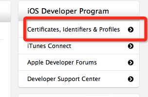

2、点击Certificates，如下。

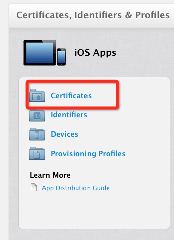

3、点击App IDs进入AppId设置。

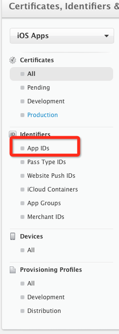

4、新增一个唯一的Bundle Identifier的AppId，并把Push Notifications勾选上。刚勾选上的时候状态不是 Enabled，应该是Configuration。

##二、创建开发推送证书和开发证书

***

1、在创建开发证书之前，我们需要在本地生成一对钥匙，打开钥匙串访问。红框中michael.*是怎么来的，请看第六步。

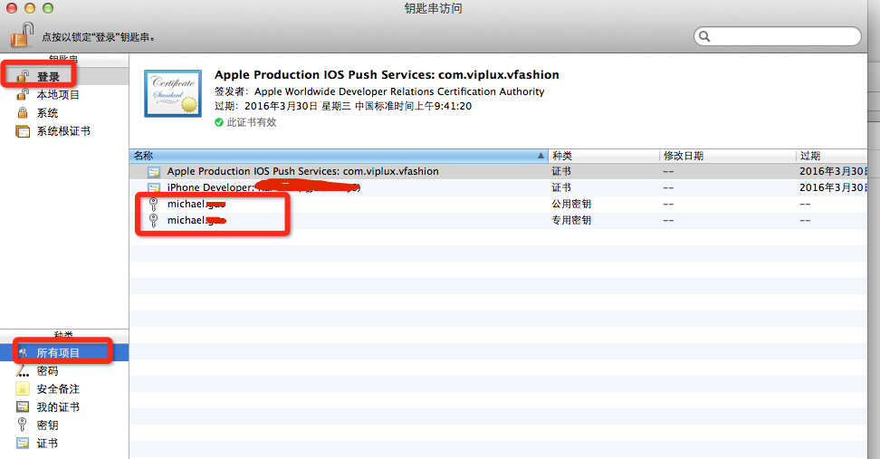

2、如下图，从证书颁发机构请求证书。

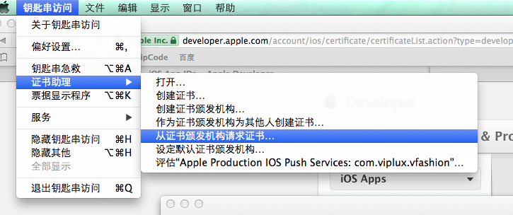

3、如下图，填邮件地址和常用名称，然后勾选存储到磁盘，一直下一步，到生成CertificateSigningRequest.certSigningRequest文件，同时，钥匙串访问里面就会生成上面说的一对秘钥michael.*。

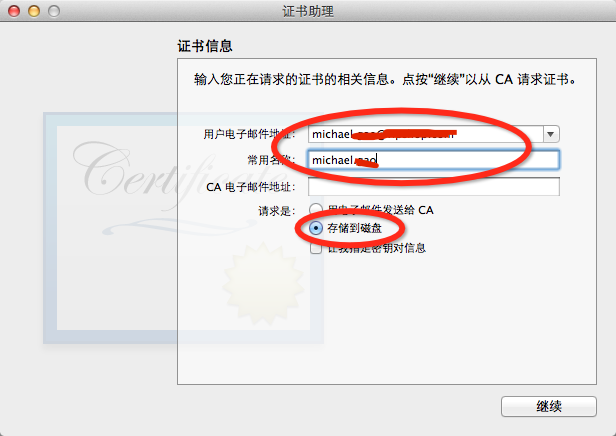

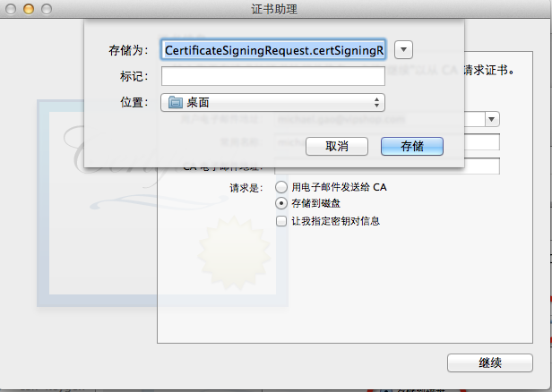

4、直到上面，一对私钥已经生成了，下面可以用它来生成开发证书了。点击Development，然后点击加号，新增一个证书。

5、一个账号至少会有一个开发证书，因为我这里新建过了，所以IOS App Development不能点击，我们创建推送证书，这个证书是用来给后台服务器用的。

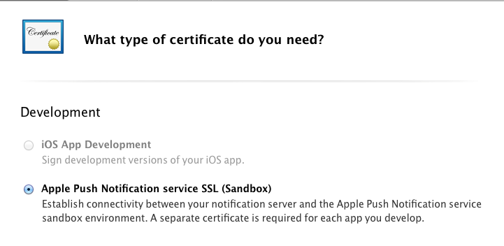

6、选AppId的时候就选之前创建的不带通配符的Bundle Identifier，然后一直点击continue

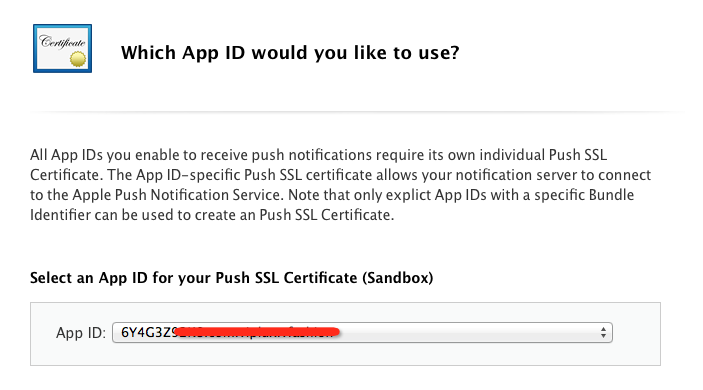

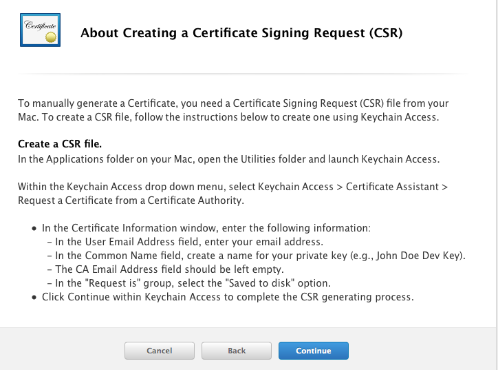

7、这里选择之前创建的CertificateSigningRequest.certSigningRequest文件，然后点击Generate。这样推送证书就制作好了，点击下载，一般文件名会叫做aps_development.cer。

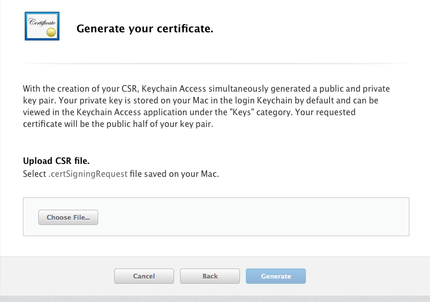

8、创建开发证书，其实和创建推送开发证书过程类似，只不过这个证书是用于给机器调试的，而推送开发证书是给后台做验证用的。此处我就不再创建开发证书，开发证书创建成功后叫ios_development.cer，双击这个文件加入到钥匙串中。

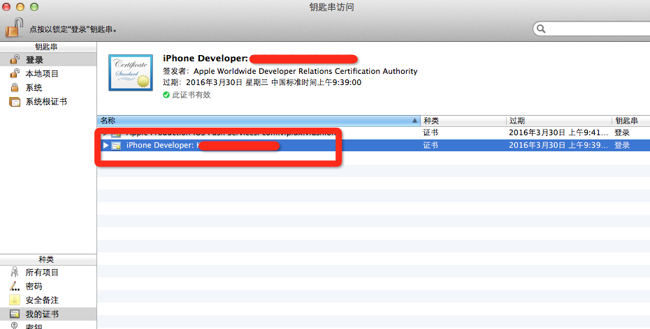

9、双击刚刚创建的推送开发证书aps_development.cer，就会加到钥匙串里面。

##三、制作后台证书

***

1、右键，导出该证书，注意不要展开。

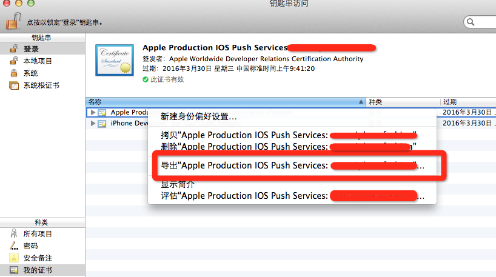

2、命名为Push，存储的文件为Push.p12。

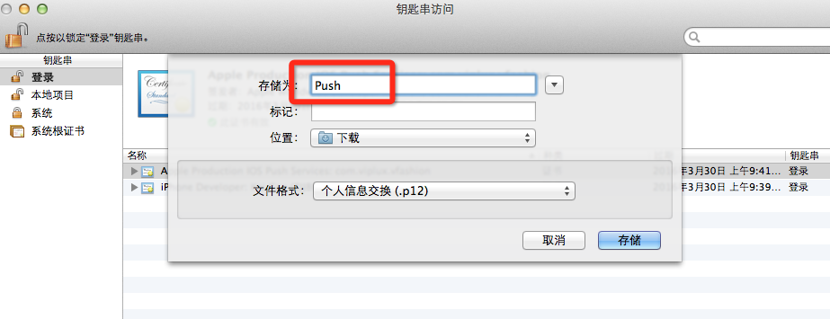

3、打开Terminal，用命令把aps_development.cer文件，转为pem文件【PushChatCert.pem】

	    openssl x509 -in aps_development.cer -inform der -out PushChatCert.pem    

4、用命令把Push.p12文件转为pem文件【PushChatKey.pem】

	    openssl pkcs12 -nocerts -out PushChatKey.pem -in Push.p12

5、用命令把2个pem合成一个文件，ck.pem文件就是服务端要的文件，操作过程中会要求输入密码，这里不就不再赘述。

	    cat PushChatCert.pem PushChatKey.pem > ck.pem

6、用telnet命令测试连接苹果推送服务器

		telnet gateway.sandbox.push.apple.com 2195

7、用生成的SSL证书和私钥来设置一个安全的链接去链接苹果服务器

	    openssl s_client -connect gateway.sandbox.push.apple.com:2195 -cert PushChatCert.pem -key PushChatKey.pem

##四、制作Profile文件

***

1、这个时候就需要制作Profile文件，Profile文件里面主要包含了调试设备信息和开发证书信息。制作方法也很简单，制作完成后，会生成DevProfile.mobileprovision文件，双击打开，就会加到Xcode中。

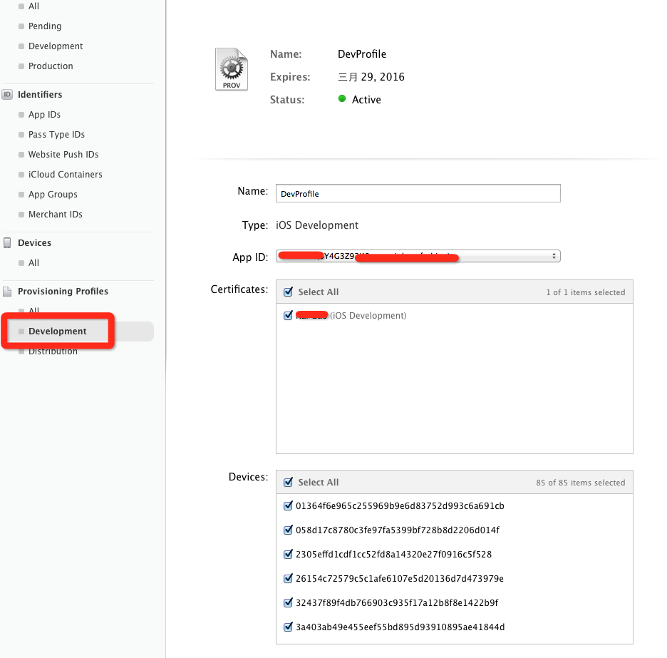

2、我们打开xcode，Code Signing Identity选择为开发证书，Provisioning Profile为Automatic就行了。这个时候就可以打包到调试设备了，运行一下，在appdelegate里面把deviceToken获取到，后面有用。

##五、验证ck.pem文件

***

1、测试ck.pem文件是否可行，我们使用ruby来验证比较方便。可以使用[houston](https://github.com/nomad/houston)

	gem install houston
	
2、安装好后，把下面这段代码拷贝到houston.rb文件中，其中文件路径和token需要修改下。

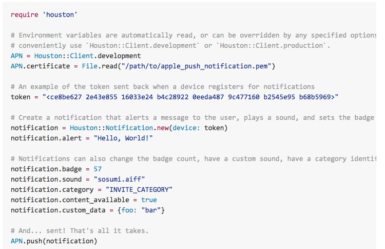

3、运行ruby houston.rb，如果证书ok，调试设备就能获得推送消息。
